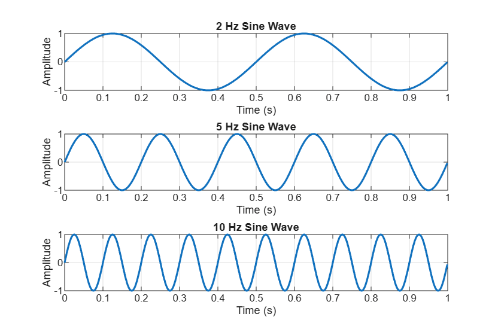
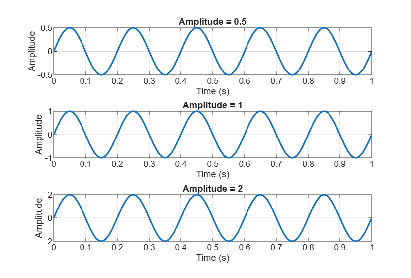
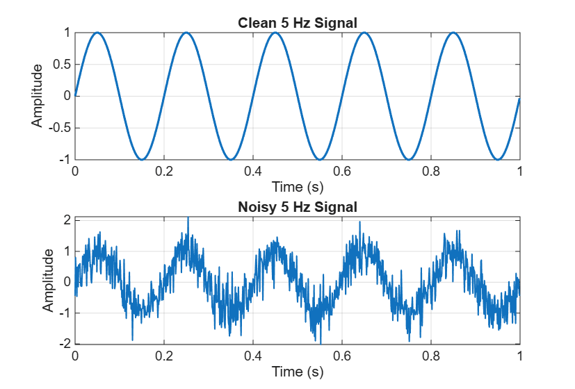

# Lecture 01 – Visualizing Simple Signals in MATLAB

## Objective

The purpose of this assignment was to learn how to create and visualize
simple signals in MATLAB. I worked with frequency, amplitude, and noise
and observed how they affect a signal.

---

## Task 1 – Create a Sine Wave

I created a sine wave with:

- Amplitude = 1
- Frequency = 5 Hz
- Duration = 1 second

The signal completes 5 cycles during one second.

---

## Task 2 – Compare Different Frequencies

I created three sine waves with frequencies of 2 Hz, 5 Hz, and 10 Hz.
The signals were displayed using subplots so that I could compare them.

### 1. Which signal changes fastest?

The 10 Hz signal changes fastest because it completes the most cycles
in one second.

### 2. Which signal has the lowest frequency?

The 2 Hz signal has the lowest frequency. It completes only 2 cycles
in one second.

### 3. How can you see the difference in the plots?

I can see the difference by looking at the number of cycles in one
second. The 2 Hz signal has 2 cycles, the 5 Hz signal has 5 cycles,
and the 10 Hz signal has 10 cycles.

A higher frequency means that the signal changes faster.

---

## Task 3 – Compare Different Amplitudes

I created three 5 Hz sine waves with amplitudes of 0.5, 1, and 2.

### 1. Which signal has the largest amplitude?

The signal with amplitude 2 has the largest amplitude. Its positive and
negative peaks are larger than the other two signals.

### 2. Does changing amplitude change frequency?

No. Changing the amplitude changes the height of the signal, but the
frequency stays the same. All three signals still complete 5 cycles in
one second.

### 3. Give one real-world example where amplitude is important.

One example is an audio signal. A larger signal amplitude generally
represents a stronger sound signal, while a smaller amplitude represents
a weaker sound signal.

---

## Task 4 – Add Noise

I created a clean 5 Hz sine wave and added random noise to it. I displayed
the clean and noisy signals using subplots.

### 1. What changed after adding noise?

After adding noise, the signal became more irregular and was no longer
as smooth as the clean sine wave.

### 2. Can you still recognize the original signal?

Yes. I can still recognize the general shape of the original sine wave,
but there are random variations around it.

### 3. Give one real-world source of signal noise.

One example is electrical interference. It can affect signals measured
by electronic sensors and make the measurements less clear.

---

## What I Learned

From the figures, I observed that:

- Increasing frequency increases the number of cycles in one second.
- Increasing amplitude makes the signal taller but does not change its frequency.
- Adding noise makes a signal less smooth and more difficult to observe clearly.
- MATLAB can be used to generate, visualize, compare, and save signals.

---

## AI Usage

**AI Tool Used:** ChatGPT

**Prompt:**  
Help me understand and create MATLAB code for generating a 5 Hz sine
wave, comparing different frequencies and amplitudes, and adding random
noise.

**What AI Suggested:**  
ChatGPT helped explain how to generate sine waves in MATLAB, use subplots
to compare signals, add random noise, and save the figures as PNG files.

**Did the code work immediately?**  
I ran the code in MATLAB Online and checked the results. I made sure the
script ran without errors and produced the required figures.

**What did I modify?**  
I organized the code according to the assignment tasks and made sure the
plots had titles, axis labels, grids, and the required filenames.

**How did I verify the result?**  
I checked the MATLAB figures myself. I verified that the 2 Hz, 5 Hz, and
10 Hz signals had the expected number of cycles. I also checked that
changing amplitude changed the height of the signal without changing its
frequency. Finally, I checked that adding noise made the signal irregular
while the original sine-wave pattern was still visible.

---

## Files

This assignment contains:

- `Lecture01_signal_visualization.m`
- `README.md`
- `frequency_comparison.png`
- `amplitude_comparison.png`
- `clean_vs_noisy_signal.png`