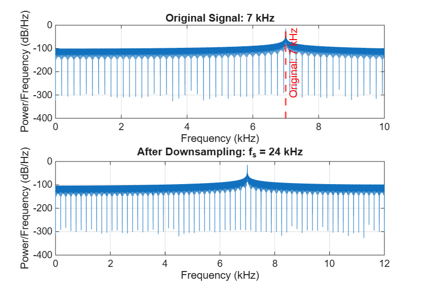
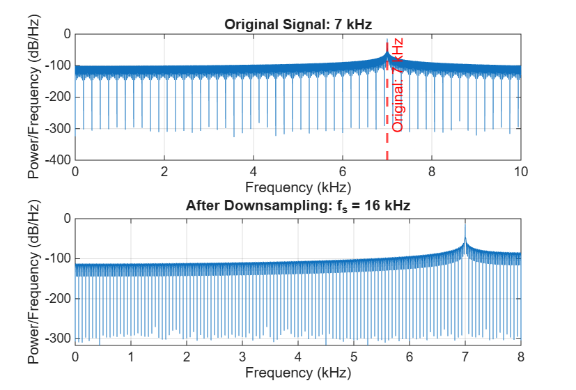
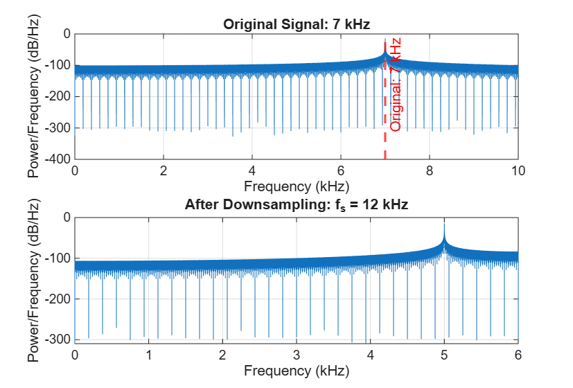
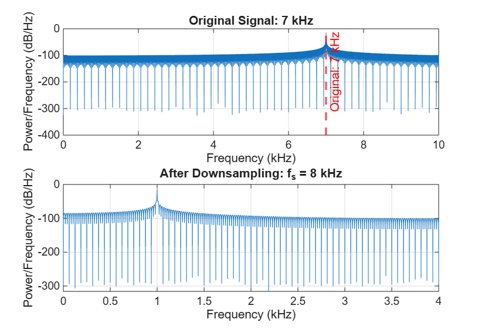

# Audio Sampling and Aliasing Experiment

## Purpose

The purpose of this experiment was to see how changing the sampling
frequency affects a 7 kHz audio signal. I listened to the signals and
compared their frequency spectra to see when aliasing occurred.

## Results

| Sampling Frequency | Nyquist Frequency | Observed Peak | Aliasing |
|--------------------|-------------------|---------------|----------|
| 24 kHz | 12 kHz | 7 kHz | No |
| 16 kHz | 8 kHz | 7 kHz | No |
| 12 kHz | 6 kHz | 5 kHz | Yes |
| 8 kHz | 4 kHz | 1 kHz | Yes |

## Questions

### 1. Which sampling frequencies represented the 7 kHz signal correctly?

24 kHz and 16 kHz represented the 7 kHz signal correctly.

### 2. When did the 7 kHz signal appear as another frequency?

At a sampling frequency of 12 kHz, the 7 kHz signal appeared as 5 kHz.
At 8 kHz, it appeared as 1 kHz.

### 3. What happened when the Nyquist frequency became lower than 7 kHz?

Aliasing occurred. The original 7 kHz signal appeared as a lower
frequency in the spectrum.

### 4. Did the aliased signal sound different?

Yes. The aliased signals sounded lower in frequency than the original
7 kHz signal.

### 5. Why can MATLAB not recover the original 7 kHz signal after aliasing?

After aliasing, the samples no longer contain enough information to
uniquely identify the original frequency. Different frequencies can
produce the same sampled data.

## Spectrum Figures

### Sampling at 24 kHz

### Sampling at 16 kHz

### Sampling at 12 kHz

### Sampling at 8 kHz

